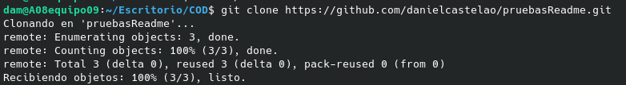
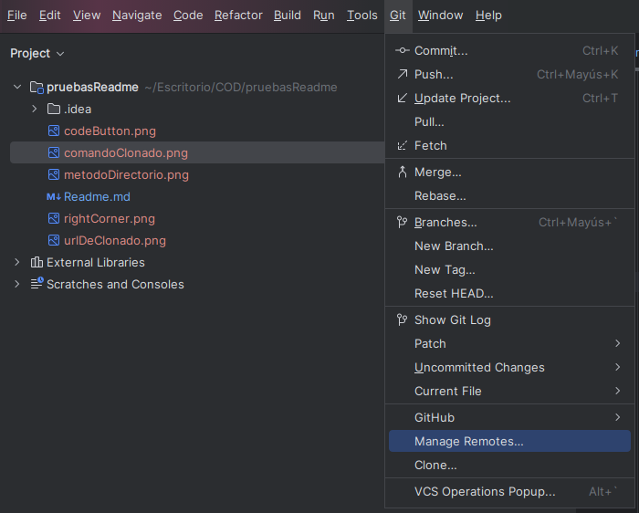
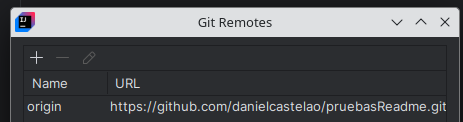
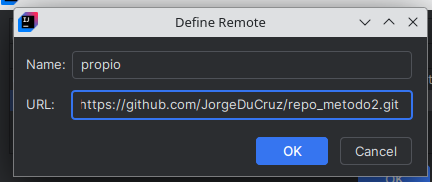
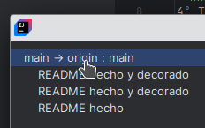
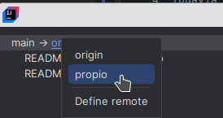

# Metodo 2 
1º Accede al repositoirio que quieres clonar  
2º Copia el enlace del repositorio desde el boton verde que pone `code`
  
  
3º Desde la consola ir al directorio en el que  quieres clonar el repositorio  
   
4º Todavia en la consola escribe `git clone` y pega el enlace y ya esta clonado  
  
5º Desde intelliji en las 4 rayas de la esquina superior izquierda despliega un menú, vas al apartado "Git" y luego al manage remotes  
  
  
6º Una vez en el manage remotes presionas el `+` para agregar un nuevo repositorio remoto, se abrira una ventana donde debes
ponerle un nombre nuevo y debes copiar el enlace del repositorio de github en el que quieras subir tus moificaciones 
  
  
7º Cuando hagas el push debes cambiar el repositorio al que se realizara el push
desde el actual al que añadiste previamente.  
  
